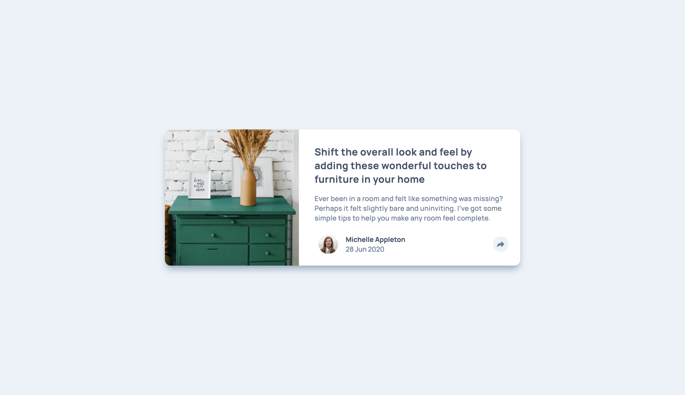
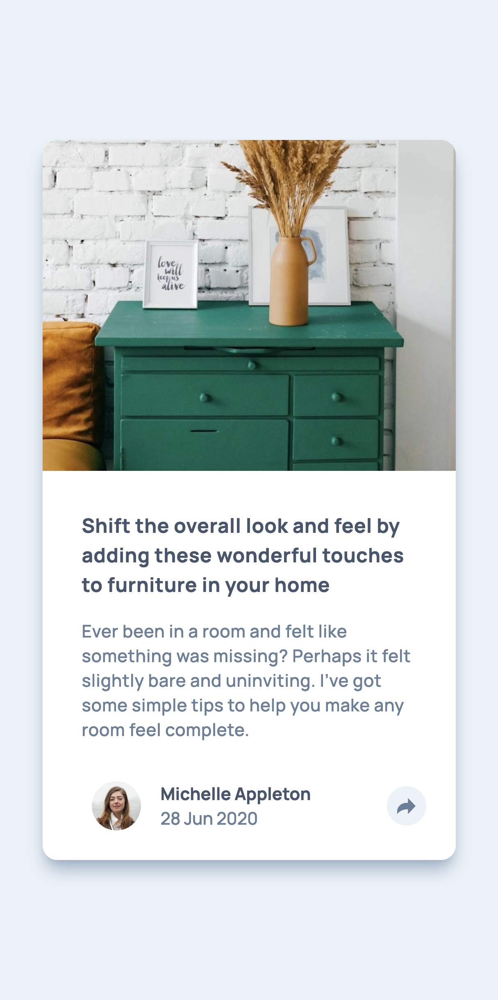

# Frontend Mentor - Article preview component solution

This is a solution to the [Article preview component challenge on Frontend Mentor](https://www.frontendmentor.io/challenges/article-preview-component-dYBN_pYFT). Frontend Mentor challenges help you improve your coding skills by building realistic projects.

## Table of contents

- [Overview](#overview)
  - [The challenge](#the-challenge)
  - [Screenshot](#screenshot)
  - [Links](#links)
- [My process](#my-process)
  - [Built with](#built-with)
  - [What I learned](#what-i-learned)
  - [Useful resources](#useful-resources)

## Overview

### The challenge

Users should be able to:

- View the optimal layout for the component depending on their device's screen size
- See the social media share links when they click the share icon, different for each screen size

### Screenshot

Desktop

Mobile

### Links

- [Live Site URL](https://article-preview-component.frilly.dev)

## My process

### Built with

- [Vue.js](https://vuejs.org/)
- [Tailwind CSS](https://tailwindcss.com/)
- [Vite](https://vitejs.dev/)
- [Astro](https://astro.build/)

### What I learned

- I learned the over-convoluted way to show different elements on different screen sizes. (Duplicate the elements and use `v-if` to show/hide them based on screen sizes.)
- Astro Islands (enable interactivity only when needed, for the case of the author display)

### Useful resources

- [Bubble Text CSS](https://projects.verou.me/bubbly/) - CSS for the bubble text for the share view on desktop.
